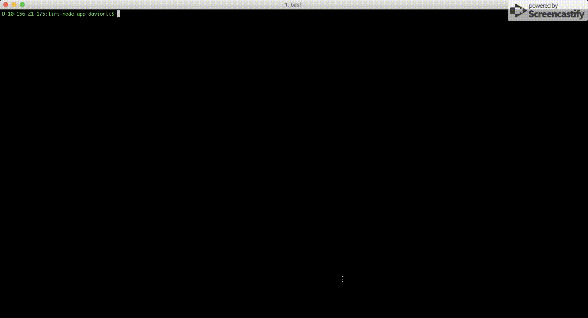
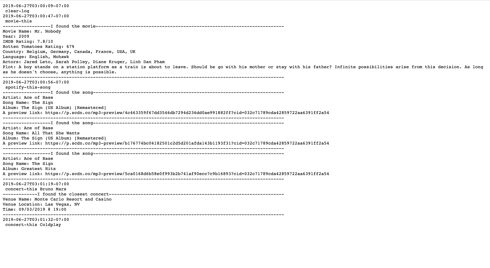

# liri-node-app
A bash/terminal command line app, built with node.js.

## Overview
The app have several funtions now.
* Search a performance of bands and artists.

    Sample Output:
    ```
    -------------I found the closest concert-----------------

    Venue Name: Monte Carlo Resort and Casino
    Venue Location: Las Vegas, NV
    Time: 09/03/2019 @ 19:00

    ---------------------------------------------------------
    ```
* Search a song by name.

    Sample Output: 
    ```
    -------------I found the song----------------------------

    Artist: Ace of Base
    Song Name: The Sign
    Album: The Sign (US Album) [Remastered]
    A preview link: https://p.scdn.co/mp3-preview/4c463359f67dd3546db7294d236dd0ae991882ff?cid=032c71789cda42859722aa6391ff2a54

    ---------------------------------------------------------
    ```
* Search a movie by name.

    Sample Output:
    ```
    -------------I found the movie---------------------------

    Movie Name: Mr. Nobody
    Year: 2009
    IMDB Rating: 7.8/10
    Rotten Tomatoes Rating: 67%
    Country: Belgium, Germany, Canada, France, USA, UK
    Language: English, Mohawk
    Actors: Jared Leto, Sarah Polley, Diane Kruger, Linh Dan Pham
    Plot: A boy stands on a station platform as a train is about to leave. Should he go with his mother or stay with his father? Infinite possibilities arise from this decision. As long as he doesn't choose, anything is possible.

    ---------------------------------------------------------
    ```
* Search weather for somewhere.

    Sample Output:
    ```
    -------------I found the weather-------------------------

    Location: Seattle, WA
    Date: 06/27/2019
    Temperature: 63 F
    Temperature feels like: 63 F
    Humidity: 72
    Skytext: Partly Cloudy
    Windspeed: 2 mph

    ---------------------------------------------------------
    ```

## Getting start

1. Install node.js

    MacOS: copy and paste the following code to Terminal
    ```bash
    curl "https://nodejs.org/dist/latest/node-${VERSION:-$(wget -qO- https://nodejs.org/dist/latest/ | sed -nE 's|.*>node-(.*)\.pkg</a>.*|\1|p')}.pkg" > "$HOME/Downloads/node-latest.pkg" && sudo installer -store -pkg "$HOME/Downloads/node-latest.pkg" -target "/"
    ```
     Windows: download the installer from Nodejs.org
    
    [Windows Installer](https://nodejs.org/en/#download)

2. Download/Clone the files from my Github Repository

    [Github Repository](https://github.com/davionli/liri-node-app)

3. In order to search songs, you need to do the following steps:
    * Go to <https://developer.spotify.com/my-applications/#!/> sign up as a developer, then create a new app. You can find your own Client ID and Client Secret in <https://developer.spotify.com/dashboard/applications>.

    * In your liri-node-app folder, create a file called .env, then copy and paste following code to your .env file. Substitute **your-spotify-id** and **your-spotify-secret** with your own keys then save.
    ```js
    # Spotify API keys

    SPOTIFY_ID=your-spotify-id
    SPOTIFY_SECRET=your-spotify-secret
    ```
4. Finally, you can run this app in the terminal/bash!

## Instruction

Since this is a command line app, you have to run it with the correct command.

1. Search concerts

    ```bash
    node liri.js concert-this <Artist/Band>
    ```

    

2. Search songs

    ```bash
    node liri.js spotify-this-song <Title>
    ```

    

3. Search movies

    ```bash
    node liri.js movie-this <Title>
    ```

    

4. Search weather

    ```bash
    node liri.js weather-there <City>
    ```

    

5. There is a bonus command, you can use the following command to run a hidden command

    ```bash
    node liri.js do-what-it-says
    ```
    Please try it yourself.

## Logging

* Your command and result will be logged into the log.txt file.

    

* You can clear the log.txt using

    ```bash
    node liri.js clear-log
    ```


## Support
The app contians the following API:

* Bands in Town Artist Events

* node-spotify-api

* OMDb API

* weather-js

Other npm libray, including:

* axios

* inquirer

* moment

* dotenv

## Fninally

This is a very exciting project, I hope I can add more functions in the future.
